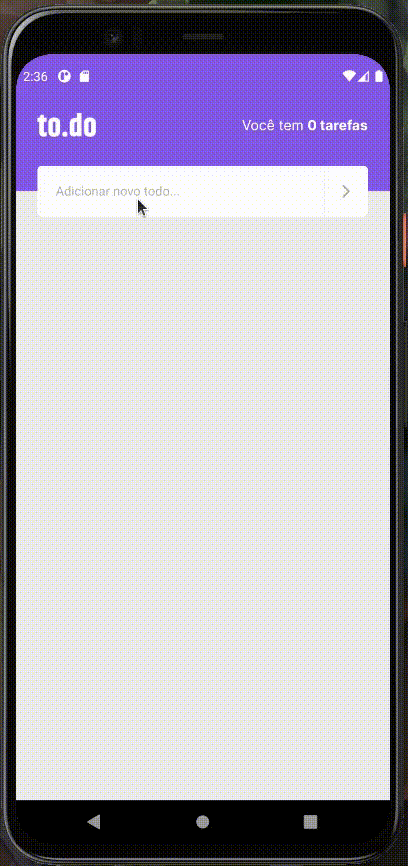

<h1 align="center">to.do - Seu aplicativo favorito de afarezes</h1>

<div align="center">



</div>

## 🧐 About <a name = "about"></a>

This is a task reminder application, focused on state manipulation in React.
The application's features are:

- Task count;
- Add a new task;
- Remove a task;
- Mark and unmark a task as complete.

## 🏁 Getting Started <a name = "getting_started"></a>

These instructions will get you a copy of the project up and running on your local machine for development and testing purposes.

### How to clone the project:

A step by step series of examples that tell you how to get a development env running.

First you have to run a git clone cli to clone the project: 

```
git clone https://github.com/lucas-hgs/desafio01-conceitos-de-react-native
```

After that, you have install all the modules that is necessary to run the project.

If you're using Yarn:

```
yarn
```

In case if you're using npm, please use:

```
npm install
```

After installing all the modules, you'll need to execute this command to run the application:


```
yarn start
```

Please, let me know if you have any question.